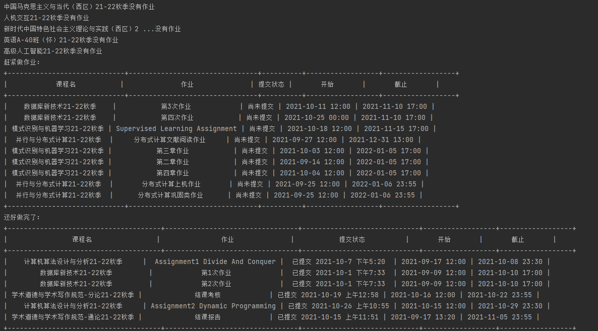

# 国科大课程网站作业状态查询

## 1. 项目介绍

​		国科大课程网站上的作业系统需要一门课一门课去查有哪些作业布置了，哪些已经交了，哪些还没提交，比较麻烦。本项目能够一键获取已选课程的所有作业状态。



## 2. 脚本流程

1. 访问sep网站
2. 如果有验证码进行ocr识别(直接调用`ddddorc`)
3. 输入账号、密码、(验证码)登录课程网站
4. 通过我的课程获取已选课程，依次查询每门课布置的作业

## 3. 脚本运行

### 3.1 chrome driver

​		项目使用的是selenium，需要用到chromedriver。chromedriver的版本要和自己本地的保持一致，默认driver文件夹下的适用于Chrome version 94。

chrome版本查询：浏览器浏览`chrome://version/`

chromedriver下载：https://sites.google.com/a/chromium.org/chromedriver/downloads

### 3.2 项目依赖

见 `requirements.txt`

```python
pip install -r requirements.txt
```

### 3.3 执行

修改 `main.py` mail函数里的账号密码, 执行即可。

```python
python main.py
```

